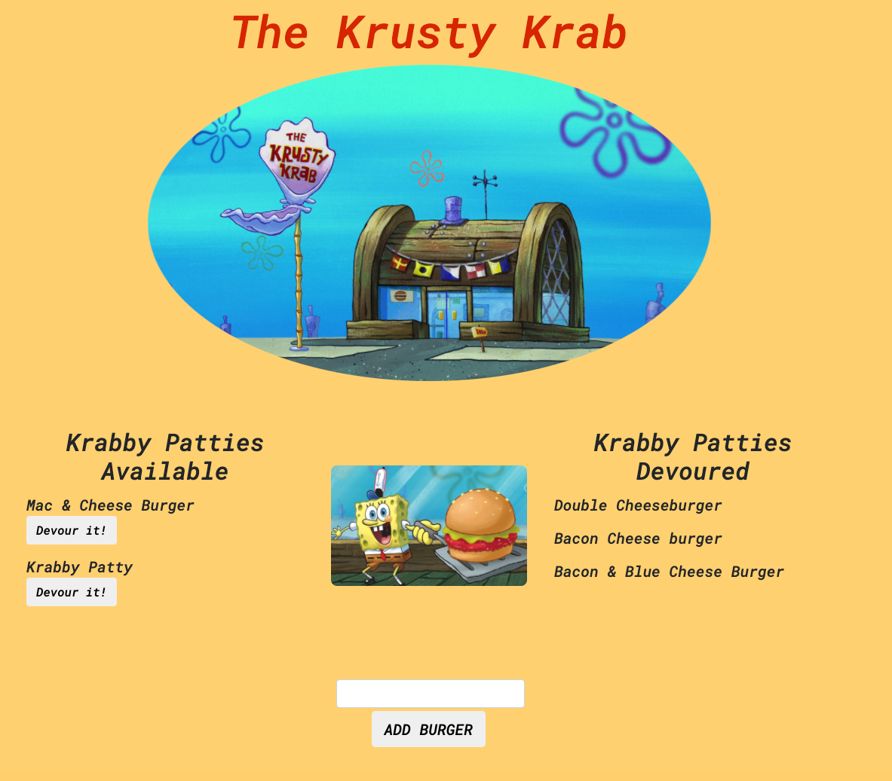

  # The Krusty Krab

  

  ## Table of Contents

  - [Image](#image)
  - [Description](#description)
  - [Deployment](#deployment)
  - [Contributors](#contributors)
  - [Contact](#contact)

  ## Description

The Krusty Krab is a restaurant app that lets users input the names of burgers they'd like to eat. Whenever a user submits a burger's name, the app will display the burger on the left side of the page, waiting to be devoured. Each burger in the waiting area also has a `Devour it!` button. When the user clicks it, the burger will move to the right side of the page.
  

  ## Deployment
  
  This app is deployed [here](https://ancient-sands-36750.herokuapp.com/)
  

  ## Contributors

  Jonathan Davila

    
  
  ## Contact:

  For questions about this application please contact me at: 
  - [Github Profile](https://github.com/jdavila10)
  - j.eche589@gmail.com
  
    